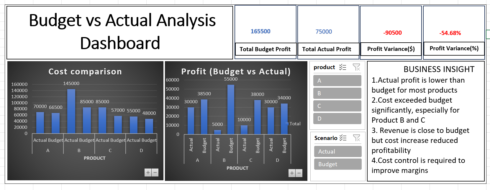

# 📊 Budget vs Actual Analysis (FP&A)

---

## 🔍 Objective
To compare actual vs budget performance and identify key drivers of profit variance.

---

## 📌 Key Findings
- Actual profit is significantly lower than budget  
- Cost exceeded budget, especially for Product B and C  
- Revenue is close to budget, but cost increase reduced profitability  

---

## 🧠 Analysis
- Cost overrun is the primary reason for negative variance  
- High-cost products are impacting overall margins  

---

## 🎯 Recommendations
- Implement cost control measures  
- Focus on cost-efficient products  
- Monitor budget vs actual regularly  

---

## 📈 Impact
Improving cost control can reduce negative variance and improve profitability
