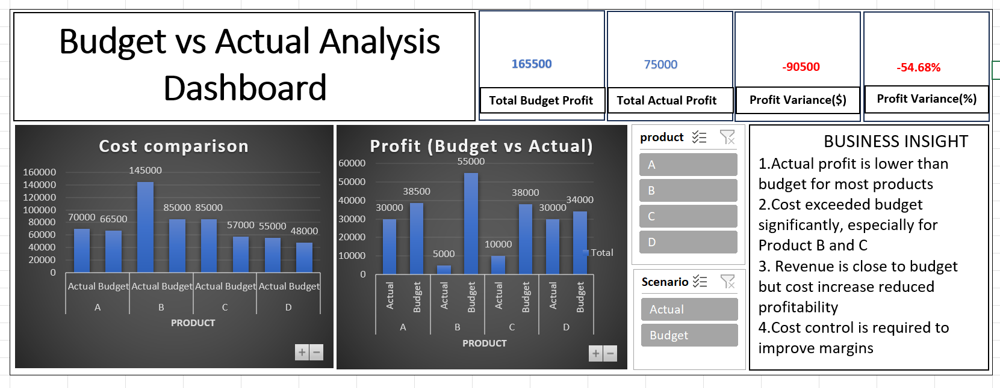

# 📊 Budget vs Actual Analysis (FP&A)

## Objective
Compare actual and budgeted performance for 4 products and find what drove the profit variance.

## Data
Simulated dataset: 4 products, one period, budget and actual revenue and cost.

## Key Findings
- Budget profit ₹1,65,500 vs. actual ₹75,000: variance −₹90,500 (−54.7%).
- Revenue was ₹8,000 above budget, but costs were ₹98,500 over budget.
- Actual profit was below budget for all four products.
- Products B and C caused ₹88,000 of the ₹98,500 cost overrun (about 89%).

| Product | Budget cost | Actual cost | Cost overrun | Budget profit | Actual profit | Profit variance |
|---|---|---|---|---|---|---|
| A | 66,500 | 70,000 | +3,500 | 38,500 | 30,000 | −8,500 |
| B | 85,000 | 1,45,000 | +60,000 | 55,000 | 5,000 | −50,000 |
| C | 57,000 | 85,000 | +28,000 | 38,000 | 10,000 | −28,000 |
| D | 48,000 | 55,000 | +7,000 | 34,000 | 30,000 | −4,000 |

## Analysis
Cost overrun is the main reason for the negative variance. Product B alone spent 71% more than its cost budget and its profit fell from ₹55,000 to ₹5,000.

## Recommendations
- Investigate Product B's cost overrun first (₹60,000 over budget), then Product C (₹28,000).
- Flag any product whose actual cost is more than 10% over budget.

## Impact
If B and C had stayed within their cost budgets, profit would have been about ₹1,63,000 against the ₹1,65,500 budget (assuming the same revenue).

## Limitations
Small simulated dataset, one period. The analysis shows where costs rose, not why (price vs. volume), because the data doesn't split them.
